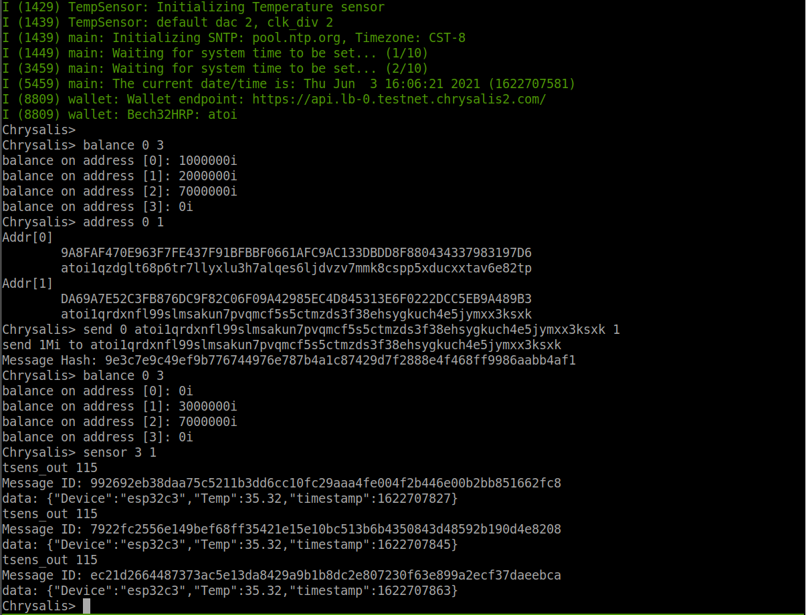
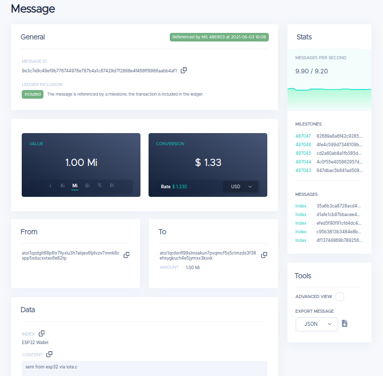

# IOTA Client Software Development Kid(SDK) for ESP32

This SDK is built on top of [iota.c](https://github.com/iotaledger/iota.c) and [ESP-IDF](https://github.com/espressif/esp-idf) for IOTA client development on ESP32 MCU series.

Learn more about [iota.c](https://github.com/iotaledger/iota.c) please visit [IOTA C Client Documentation](https://iota-c-client.readthedocs.io/en/latest/index.html)


## Example Commands

This SDK provides some example for testing and learn IOTA Client application, commands are shown below:

**Client API**

* `node_info` - Get connected node info

**Wallet**

* `balance` - Get address balance by the index rage.
* `address` - Get address by the index range.
* `send` - Send tokens from the given index to the receiver address.
* `sensor` - Send sensor data to the Tangle periodically.

**System**

* `help` - List commands
* `free` - Get the size of available heap.
* `heap` - Get heap info
* `stack` - Get main stack info
* `version` - Get esp32 and wallet versions
* `restart` - system reboot

## Requirements  

This project was tested on `ESP32-DevKitC V4` and `ESP32-C3-DevKitC 02` dev boards.

* [ESP32-DevKitC V4](https://docs.espressif.com/projects/esp-idf/en/latest/esp32/hw-reference/modules-and-boards.html#esp32-devkitc-v4)
* [ESP32-C3-DevKitC-02](https://docs.espressif.com/projects/esp-idf/en/latest/esp32c3/hw-reference/esp32c3/user-guide-devkitc-02.html#esp32-c3-devkitc-02)


## Build system setup

Please follow documentations to setup your toolchain and development framework.

* [esp32 get started](https://docs.espressif.com/projects/esp-idf/en/latest/esp32/get-started/index.html)
* [esp32-c3 get started](https://docs.espressif.com/projects/esp-idf/en/latest/esp32c3/get-started/index.html)


**Notice: We use the master branch([c13afea635a](https://github.com/espressif/esp-idf/tree/c13afea635adec735435961270d0894ff46eef85)) of ESP-IDF, make sure you clone the right branch of ESP-IDF**

Clone esp-idf from GitHub

```
$ git clone --recursive https://github.com/espressif/esp-idf.git
$ cd esp-idf
$ git submodule update --init --recursive
$ ./install.sh
$ source ./export.sh
```

### Build Wallet Application

Clone the wallet source code

```
$ git clone https://github.com/oopsmonk/iota_esp32_wallet.git
$ cd iota_esp32_wallet
$ git checkout dev_chrysalis
$ git submodule update --init --recursive
```

Here we need to set the target device before configuration.

For ESP32
```
$ idf.py set-target esp32
```

For ESP32-C3
```
$ idf.py set-target esp32c3
```

Wallet configuration and building application, please change the WiFi setting in `IOTA Wallet -> WiFi`

By default, the wallet uses a `random` seed, you can use your seed by change `(random) Wallet SEED` via **menuconfig**.

```
$ idf.py menuconfig

IOTA Wallet  --->
        WiFi  --->
        SNTP  --->
    (https://api.lb-0.testnet.chrysalis2.com/) IOTA Node URL
    (0) port number
    (random) Wallet SEED
    (60) Sensor Sampling Period
    [ ] Testing Application

$ idf.py build
```

### Run the Wallet Application



[Transaction Message](https://explorer.iota.org/testnet/message/9e3c7e9c49ef9b776744976e787b4a1c87429d7f2888e4f468ff9986aabb4af1)




[Data Message](https://explorer.iota.org/testnet/message/992692eb38daa75c5211b3dd6cc10fc29aaa4fe004f2b446e00b2bb851662fc8)


**Notice: these messages are on the `testnet` that might not be found after a network reset.**

## Troubleshooting

`E (38) boot_comm: This chip is revision 2 but the application is configured for minimum revision 3. Can't run.`

I'm using ESP32-C3 Rev2 but the current ESP-IDF uses Rev 3 as default, we need to change it via `idf.py menuconfig`

```
Component config ---> ESP32C3-Specific ---> Minimum Supported ESP32-C3 Revision (Rev 3)  ---> Rev 2
```
